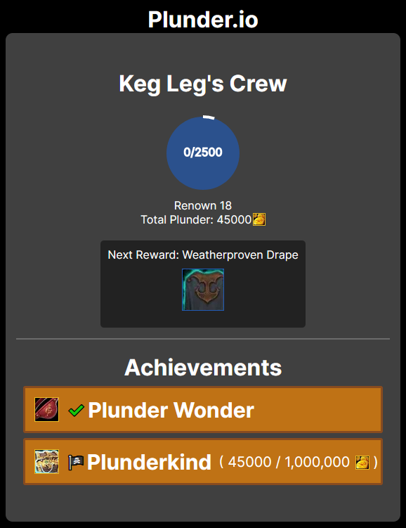

#  "World of Warcraft IO" 

This is a small self development project that I got the hankering to create. It was built to simultaneously get an understanding of both the [World of Warcraft APIs](https://develop.battle.net/documentation/world-of-warcraft) and [Next.js](https://nextjs.org/). 

The initial motivation was to create something basic along the lines of a character page from [raider.io](https://raider.io/) to get back into the swing of things. It developed further from there as I wanted to see how much data I could pull related to Plunderstorm, the new WoW Battle Royale game mode.

Character Page:

Plunderstorm Page:

Yes it's basic. I just wanted to try something.